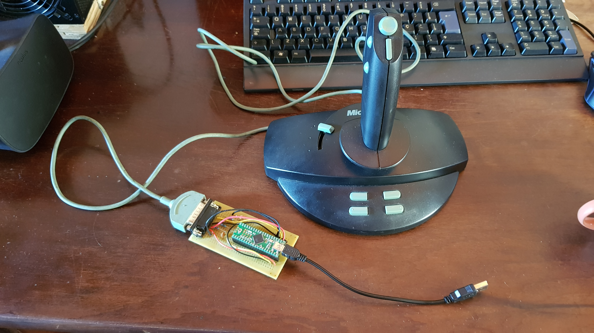

# Microsoft Sidewinder 3D Pro USB Adapter



Using [sw3dprousb](https://code.google.com/archive/p/sw3dprousb/) project. Just added a makefile and schematics.

## Links

* [Wikipedia](https://en.wikipedia.org/wiki/Microsoft_SideWinder#3D_Pro)

* [DescentBB](http://www.descentbb.net/viewtopic.php?p=250537#250537)
 

## Useful Stuff

### List USB Devices on Mac

```bash
ioreg -p IOUSB -l -w 0
```